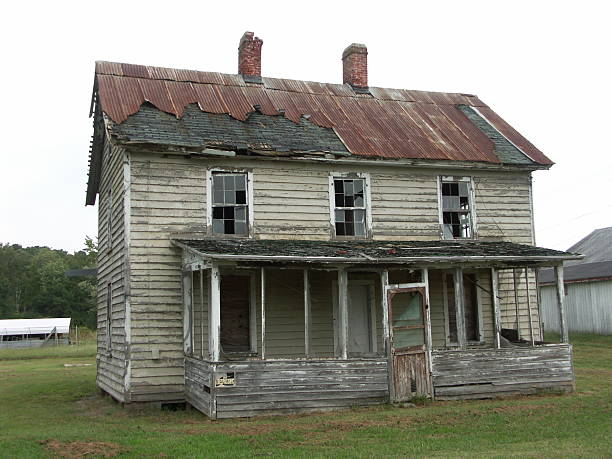

# HW 1 - CS 625, Spring 2024

Demetrius Wright 
Due: January 17, 2024

## Git, GitHub

*What is the URL of the GitHub repo that you created in your personal account?*
https://github.com/demetriuswright24/DemetriusWright625
   
*In which direction does the 'push' command work (send local changes to remote OR send remote changes to local)?*

The direction that the 'push' command works is sending local changes of a project residing on your machine, to the remote repository. So, you push your local work to the remote

*You have committed a change on your local machine/remote. However, you want to undo the changes committed. How would you do that?*

You could revert to the last commit. First, you could run git log to see your previous commit. After doing that, you can run "git checkout theCheckoutId to update your current project that you're working on, to that of the commit of your choice

Additionally, you could do "git reset --soft HEAD^" or "git reset --hard HEAD^", dependent on whether you'd like to keep the progress you currently have on your work

## Markdown

*Create a bulleted list with at least 3 items*
- bike
- book
- bird

*Write a single paragraph that demonstrates the use of italics, bold, bold italics, code, and includes a link. The paragraph does not have to make sense.*

*Hello, in order to use italics, you must use the asterisk.* **Regarding the bold, you must use two asterisks.** ***On the topic of bold italics, use three asterisks.*** <code> In the form of code, use the word code with < and >. <code> Lastly, here's a [link](https://optical.toys/waterfall-effect/)

*Create a level 3 heading*
### I live in an apartment complex so I don't have a photo of my house, but here's a photo of a random house

*Insert a image of your house, sized appropriately*

## Tableau

*Insert the image of your horizontal bar chart here. Reminder, this should show top 10 state names that has highest population in USA.*

## Google Colab

*What is the URL of your Google Colab notebook?*
[Colab Notebook](https://colab.research.google.com/drive/1XYWMfDLmtLRCvDwIsOdlxQ7OPBbCN05l?usp=sharing)

## Python/Seaborn

*Insert the first penguin chart here*

*Describe what the figure is showing.*

In this figure, a depiction of depth of penguin bill depth and penguin bill length is illustrated by way of a scatter plot.

*Insert the second penguin chart here*

*Describe what the figure is showing.*

In the second figure, a depiction of the body mass of several penguin; Adelie, Gentoo, and Chinstrap, are illustrated by way of a bar plot. In the second figure, it also depicts the mass of each sex, seperated by the afforemention penguin types.

*What happened when you removed the outer parentheses from the code? Why?*

When I removed the outer parenthese from the code, it resulted in an error. This is because the parenteses are used to make an instance of the seaborn object, specifically, it is used in the form of breaking up what would be a very long line of code

## Observable and Vega-Lite

*What happens when you replace `markCircle()` with `markSquare()`?*

When you replace `markCircle()` with `markSquare()`, it results in the points on the scatter plot changing from circles to squares

*What happens when you replace `markCircle()` with `markPoint()`?*

When you replace `markCircle()` with `markSquare()`, it results in the points on the scatter plot changing from filled circles to empty circles

*What change do you need to make to swap the x and y axes on the scatterplot?*

In order to swap the x and y axes on the scatter plot, write `vl.x().fieldQ("Miles_pper_Gallon")` and `vl.y().fieldQ("Horsepower")`

*Insert the bar chart image here*

*Why do you think this chart is the result of this code change?*

I believe that this is the resulting chart because it removes the y variable(s) required to illustrate y data
## References

*Every report must list the references (including the URL) that you consulted while completing the assignment. Replace the items below with the references you consulted*

* Git Tutorial, <https://youtu.be/USjZcfj8yxE?si=mtmXR509ESboRwla>
* Github Tutorial, <https://youtu.be/nhNq2kIvi9s?si=dqvTqNq7ZQEGUnB0>
* Picture of House, <https://www.istockphoto.com/>
* ChatGPT, 
* All of the Mark down references, <https://www.markdownguide.org/basic-syntax/>
* Plot in Vega-Lite, <https://www.example.com](https://observablehq.com/@observablehq/plot-vega-lite>
* Seaborn object bars, <https://seaborn.pydata.org/generated/seaborn.objects.Bars.html)https://seaborn.pydata.org/generated/seaborn.objects.Bars.html>