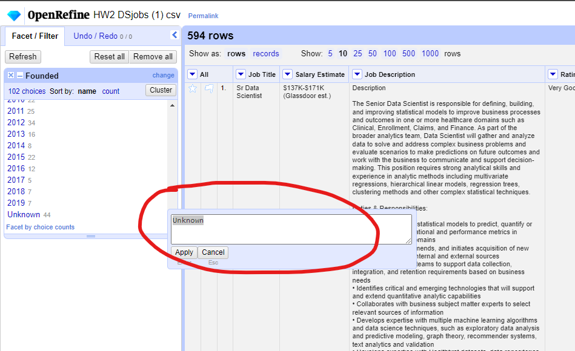

# HW 2 - CS 625, Spring 2024

Demetrius Wright 
Due: January 31, 2024

## Git, GitHub

## Part 1

- *Remove rows/columns: Remove blank rows, rows that contain misleading values (-1 for example) exists in more than one column (of the same row). Remove the columns index and Competitors.*

In an effort to remove any blank rows, and rows that contain misleading values, facets were made and searched through to take note of any and all information that is not relevant. Additionally, in order to remove the columns index and Competitors, the following method was used, not on this specific column, but on what was once index and the Competitors

- *Filling the values in the column(s): Refill the misleading values exist in the column Founded as Unknown. Similarly check values of all other columns and update the values accordingly (free to decide)*

As for filling the misleading values that exist in the column "Founded" as "Unknown", I had created a text facet, and used the "edit" buttton to rename the misleading values as "Unknown". Shown below is an example of how this was done.

- *Editing the values in the column: Replace the values exist in the column Size by filling the highest value of it. For example, "1001 to 5000 employees" to be replaced as 5000. Blank cells of the Size column should be filled with 0. Convert the data type of this column to numeric.*

This was simply done manually by opening up the Size column as a text facet, then editing the employee numbers as necessary. This was done manually as it was a fairly easy, not time consuming task to perform. Unfortunately, once exported, OpenRefine does not save any GREL operations nor does it save the history of actions performed, so there is no picture available to depict the actions taken to organize the Size column.

- *Creating a new column: Create a new column called "State name" and filled by extracting the state names exist in the column "Location". Then the column name Location must be changed as "City", and it should contain city names only.*

In order to complete this step, the method of adding a column based on another column was used heavily in order to create the new column. Additionally, to define the state's city, I had used GREL to perform a regex operation to exclude/include the necessary values for defining city. Again, as OpenRefine fails to save any history of a project after exporting it, I no longer have the exact regex command used. Regardless of this, a command that performs a similar operation is as follows: "grel:value.split(\", \")[1]"

This picture shows the use of the "Add column based on this column" functionality.

- Create a new column called "Reliability" and fill its values based on the criteria given below:

Upon creating a new column called "Reliability", and transforming the data in the column to that of a number, the values were filled in using GREL in a fashion such as this:

*grel:if(value <= 2, \"OK\", if(value <=2.5, \"Good\", \nif(value <= 3.5, \"Very Good\", \nif(value>3.5, \"Excellent\", null))))*

This is just a copy of the command used in the json

## Part 2

- *How many jobs listed by Nonprofit organization?*
36

- *Which state has the highest job openings?*
VA

- *List the company name(s) that has the lowest reliability level?*
Conagen

- *What type of job(s) advertised by companies headquartered in India?*
Data Scientist

- *Name the Biggest industry by revenue and occurrence*
AstraZeneca